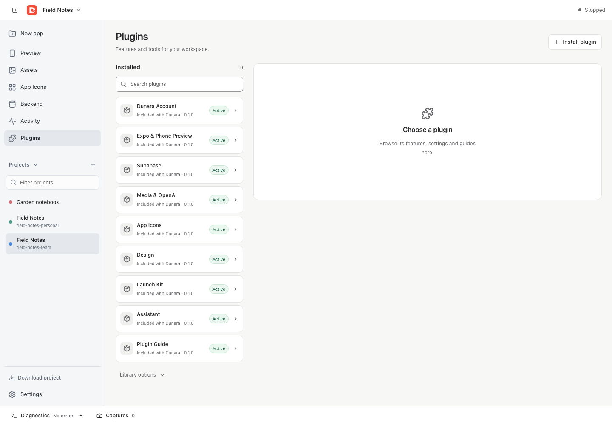
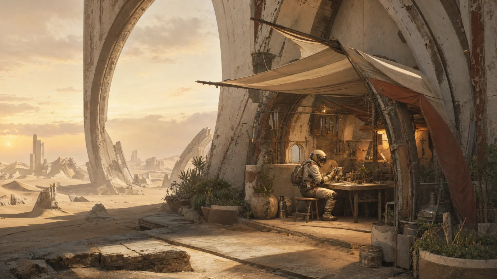

<p align="center">
  
</p>

<h1 align="center">Dunara</h1>

<p align="center"><strong>A new world. Built by you.</strong></p>
<p align="center">Build real mobile apps with AI. Preview on your phone. Keep your code.</p>

<p align="center">
  <a href="#start-building">Start building</a> ·
  <a href="#choose-your-ai">Choose your AI</a> ·
  <a href="#inside-the-studio">Explore Studio</a> ·
  <a href="docs/plugins/sdk.md">Build a plugin</a> ·
  <a href="CONTRIBUTING.md">Contribute</a>
</p>


<p align="center">
  <a href="https://github.com/grebmann1/dunara/actions/workflows/check.yml"></a>
  <a href="https://github.com/grebmann1/dunara/releases"></a>
  <a href="LICENSE"></a>
</p>

**Dunara is a local-first, extensible builder for real Expo and React Native apps.** Shape an idea in Studio, work with the built-in Assistant or your own coding agent over MCP, connect a backend, and refine the result in a live preview.

Your project is ordinary application source. Download it as a ZIP, open it in your editor, and run it independently. A hosted Dunara account is not required.

| Create | Refine | Make it yours |
| --- | --- | --- |
| A guided path from app brief to working project | Live screen previews, inspection and design presets | Full project download with source, assets and lockfiles |
| An optional Assistant with multiple AI providers | Artwork, icons and local Launch Kits | Supabase connections and reviewed backend changes |
| Your own coding agent through MCP | Source diffs and explicit restoration of managed edits | Plugins, an SDK and embeddable Studio packages |

## Start building

Use **Node.js 24** and **pnpm 11.13.1**.

```sh
git clone https://github.com/grebmann1/dunara.git
cd dunara
pnpm install --frozen-lockfile
pnpm exec playwright install chromium
pnpm build
```

**On macOS, launch Studio with the optional Assistant:**

```sh
pnpm desktop
```

The desktop host is a source-launched Electron prototype. See the [desktop guide](docs/desktop.md) for workspace options and connecting an external agent.

<details>
<summary><strong>Prefer Studio in your browser?</strong></summary>

```sh
pnpm start --workspace "$PWD/.builder/apps" --home "$PWD/.builder/home" --studio-only
```

The CLI opens an authorized local Studio session. Use the [MCP setup guide](docs/mcp-setup.md) to share a runtime with your coding agent. The standalone browser command does not include the desktop Assistant.

</details>

Execution starts disabled. After reviewing the generated code and its dependencies, add `--trust-execution` to your launch command to install and run the app. Generated code runs with your user permissions; local execution is not a security sandbox. See [security](SECURITY.md).

### Your first app

1. **Describe the idea.** Capture the audience, the problem and the screens in a short app brief.
2. **Choose the backend.** Connect Supabase before creation, or choose **No backend for now**.
3. **Create and refine.** Work with Assistant or your MCP agent; adjust design, review assets and inspect the app.
4. **Preview and test.** Move between screens, compare phone sizes and follow the [phone-testing guide](docs/phone-and-environment-guide.md).
5. **Take the source with you.** Choose **Download project → Download ZIP**. The archive includes setup instructions for running outside Dunara.

The built-in journey keeps the next step close without covering your canvas. The [complete workflow](docs/build-refine-export.md) covers screenshots, app icons, Launch Kits and export.

## Inside the Studio



*Actual Studio capture from a disposable project, with Preview stopped.*

**A workspace for the whole app.** Switch between Preview, Assets, App Icons, Backend and Activity. A searchable project list keeps multiple apps within reach; guidance opens when you need it.

**Design you can inspect.** Use presets and tokens, compare screen sizes, capture views and share Inspector context with your agent. Review generated or imported artwork before placing it in your app.

**A backend you can review.** Connect Supabase, choose environments and stage configuration changes for approval. Enter private credentials through Studio's dedicated settings. [Set up Supabase →](docs/backend-setup.md)

**Source you can own.** Download source, assets, configuration, lockfiles and backend files. Dependencies, generated output, credentials and local Studio history stay out of the ZIP. Export does not sign an app or publish it to a store. [See what is included →](docs/project-export.md)

## Choose your AI

The desktop Assistant supports several connections at once. Open **Settings → AI connections**, connect your providers, then choose a model in Settings or directly in chat.

| Connection | How to connect |
| --- | --- |
| ChatGPT | Sign in with your account |
| Grok | Sign in with your account using the device-code flow |
| OpenAI · Anthropic · Google Gemini · Mistral · xAI | API key, with an optional compatible HTTPS endpoint |

Use **Plan** to inspect and work through an approach, or **Build** to apply changes through Dunara's reviewed operations. Provider and model access depend on your account. Connections can last for the session or use optional encrypted storage; connecting a provider does not send a message.

Prefer your existing tools? Connect a coding agent over **MCP** to the same projects, previews and operations. AI is optional for local project management, asset imports and source export.

[Assistant guide](docs/assistant.md) · [MCP setup](docs/mcp-setup.md) · [Credential storage](docs/credentials.md)

## Extend your workspace

Plugins add tools and workflows to Studio. The bundled set covers design, media, app icons, Supabase, previewing and Launch Kits. Install reviewed plugins through Studio, or build one with the SDK.

- [Use and manage plugins](docs/plugins/README.md)
- [Create a plugin](docs/plugins/sdk.md)
- [Plugin guide for agents](docs/plugins/agent-guide.md)

Dunara also ships five reusable packages:

| Package | Purpose |
| --- | --- |
| `@mobile-builder/runtime` | Builder engine, CLI, HTTP, MCP and optional Assistant |
| `@mobile-builder/studio` | Embeddable Studio UI |
| `@mobile-builder/plugin-sdk` | Plugin contracts and authoring tools |
| `@mobile-builder/catalog` | Shared presets, template metadata and brand assets |
| `@mobile-builder/execution` | Execution adapters for host integrations |

Install the coordinated archives from [GitHub releases](https://github.com/grebmann1/dunara/releases). The [package guide](docs/package-guide.md) explains exact versions, integrity receipts and embedding. Public npm distribution is not configured.

## Find your next step

| I want to… | Start here |
| --- | --- |
| Build, refine and export an app | [Workflow](docs/build-refine-export.md) |
| Test on a phone | [Phone testing and environments](docs/phone-and-environment-guide.md) |
| Configure backend services | [Supabase configuration](docs/supabase-configuration.md) |
| Make artwork and app icons | [Media workflow](docs/media-workflow.md) |
| Build and install on iPhone | [Local native delivery](docs/native-build-setup.md) |
| Understand the implementation | [Architecture](docs/architecture.md) |
| Contribute a change | [Contributing](CONTRIBUTING.md) |

<details>
<summary><strong>Development checks</strong></summary>

```sh
pnpm typecheck
pnpm lint
pnpm test
pnpm build:packages
pnpm test:packages
pnpm test:e2e
```

Package qualification uses a clean source commit. Tests use disposable projects and fixture credentials. Browser tests do not qualify physical devices, native signing or live provider services.

</details>



<p align="center"><strong>Make something worth finding.</strong></p>

This repository contains the open-source builder, Studio, CLI, SDK, templates, bundled plugins and execution adapters. The marketing website and managed cloud service are maintained separately and consume released packages.

[Apache-2.0](LICENSE) · [Third-party notices](THIRD_PARTY.md) · [Security](SECURITY.md) · [Artwork and image provenance](docs/images/readme/README.md)

The repository begins with a reviewed source snapshot. Earlier private history was not imported; [migration receipts](migration/source-map.json) preserve file provenance.
